<!--
  🌸 wobuzhidao's anime profile
  Style: config/profile.json → "style": "manga" or "sakura-day" (see docs/STYLES.md).
  Images in assets/generated/ and the blocks between …:START and …:END markers are rebuilt automatically — don't edit them by hand.
  Texts, skills, socials and the manga-style images live in config/profile.json, quotes in data/quotes.json.
  Spots to fill in right here are marked ✏️.
-->

  

<!-- TYPING:START -->

  

<!-- TYPING:END -->

<!-- BADGES:START -->

  
  

<!-- BADGES:END -->

<h2 align="center">🌸 About me · 自己紹介</h2>

  

<!-- ✏️ Anime GIF: upload a file to assets/ (e.g. assets/my.gif) and uncomment the line below:

-->

<h2 align="center">Arsenal · 技術スタック</h2>

<!-- Skills live in config/profile.json → skills (ids as on https://skillicons.dev) -->
<!-- SKILLS:START -->

<b>Main stack · Middle</b>

  
  
  
  

<b>Learning for fun · 勉強中</b>

  
  

<!-- SKILLS:END -->

  

<!-- ANIME-LIST:START -->
<!-- Put your AniList or Shikimori username into config/profile.json → anime_list to show a 'Now watching' card here -->
<!-- ANIME-LIST:END -->

<!-- VIEWS:START -->

  
  

<!-- VIEWS:END -->

  

