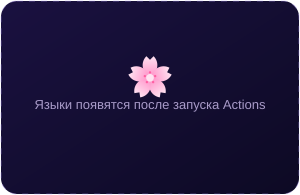
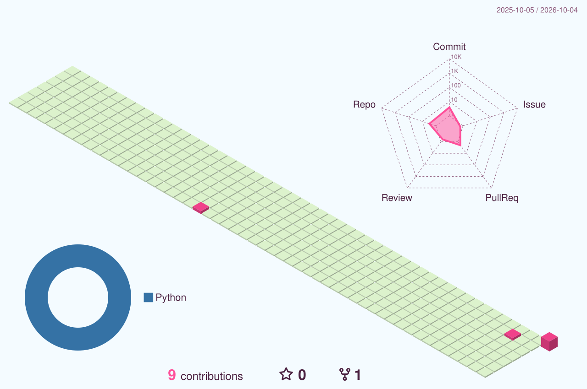

<!--
  🌸 Аниме-профиль wobuzhidao
  Картинки в assets/generated/ пересобираются сами каждые 6 часов (.github/workflows/anime-profile.yml).
  Тексты баннера, окна статуса и подвала меняются в config/profile.json, цитаты — в data/quotes.json.
  Места, которые стоит заполнить своим, помечены ✏️.
-->

  

  

  
  
  
  <!-- ✏️ Сюда можно добавить свои соцсети, например:
  
  
  -->

<h2 align="center">🌸 Обо мне · 自己紹介</h2>

  

<!-- ✏️ Замени строки ниже на свои -->
- 🎌 **Кто я:** путник из мира кода, который однажды открыл первое аниме и не смог остановиться
- 🔭 **Сейчас работаю над:** своими проектами — загляни в репозитории
- 🌱 **Прокачиваю навык:** что-нибудь новое каждую неделю
- 📺 **Любимые тайтлы:** Frieren · Steins;Gate · Bocchi the Rock!
- 🎧 **В наушниках:** опенинги на повторе
- ⚡ **Факт:** код компилируется быстрее, если включить опенинг (научно не доказано)

<!-- ✏️ Аниме-гифка. Загрузи файл в папку assets/ (например assets/my.gif) и раскомментируй строку ниже:

-->

<h2 align="center">⚔️ Арсенал · 技術スタック</h2>

<!-- ✏️ Поменяй список иконок под себя: https://github.com/tandpfun/skill-icons#icons-list -->

  

<h2 align="center">📊 Статистика · 統計</h2>

  
  

  

  

  

<h2 align="center">🐍 Змейка ест мои коммиты · 蛇</h2>

  

<h2 align="center">💬 Цитата дня · 今日の名言</h2>

  

<!-- ANIME-LIST:START -->
<!-- Впиши свой ник AniList или Shikimori в config/profile.json → anime_list, и здесь появится карточка «Сейчас смотрю» -->
<!-- ANIME-LIST:END -->

  
   
  ☝️ столько путников уже заглянуло в профиль

  

